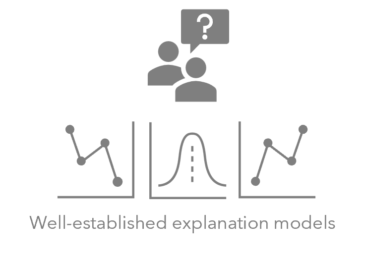

# Diverse Explanations From Data-Driven and Domain-Driven Perspectives in the Physical Sciences
## Abstract

Machine learning methods have been remarkably successful in material science, providing novel scientific insights, guiding future laboratory experiments, and accelerating materials discovery. Despite the promising performance of these models, understanding the decisions they make is also essential to ensure the scientific value of their outcomes. However, there is a recent and ongoing debate about the diversity of explanations, which potentially leads to scientific inconsistency.
In this article, we explicitly illustrate diverse explanations of applications in the material sciences from well-trained machine learning models. We summarise the reasons behind these diverse explanations and discuss the potential way to find an accurate model with expected explanations that reinforce physical laws without compromising accuracy and generalisability. Our goal is to foster a comprehensive understanding of these inconsistencies and ultimately contribute to the integration of eXplainable Artificial Intelligence (XAI) into physical science.

   

## Installation

Instructions on how to install the necessary dependencies for this project.

```plaintext
pip install -r requirements.txt

